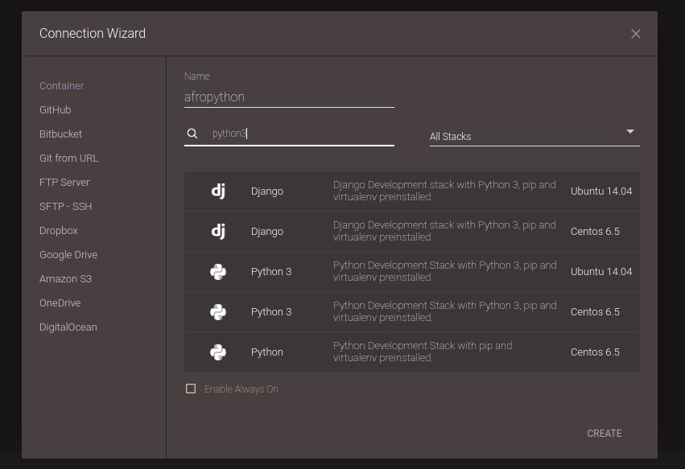

# Criando um container

## Vá para o editor e crie um novo container

Clique no botão "Editor". Deve abrir o assistente de conexão (Connection Wizard) - se isso não acontecer, você pode encontrá-lo em File/New Connection/Container.

Na janela do Connection Wizard, dê o nome "afropython" a seu projeto e use a caixa de busca (search stack) para pesquisar por python3. Apareceram várias opções, né? Então, para que tudo dê certinho, vamos nos certificar de escolher aquela que diz "Python 3" **E** "Ubuntu 14.04". Ou seja, vamos utilizar um computador que já tem o GNU/Linux Ubuntu instalado, com a versão mais recente do Python. Após selecionar corretamente, clique em "Create" (você pode ter de usar a barra de rolagem para encontrar esse botão, que fica lá embaixo).

