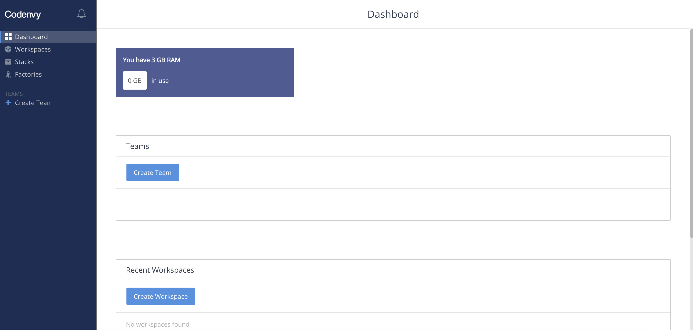
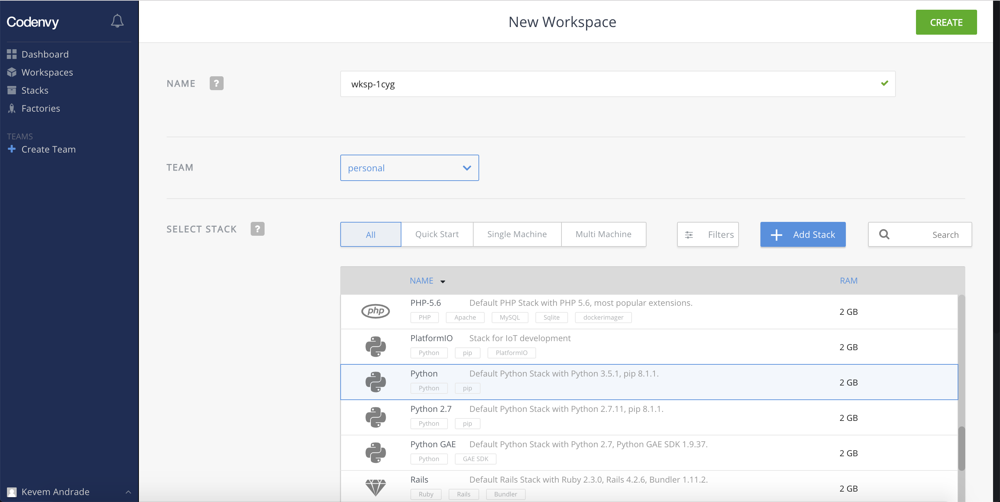
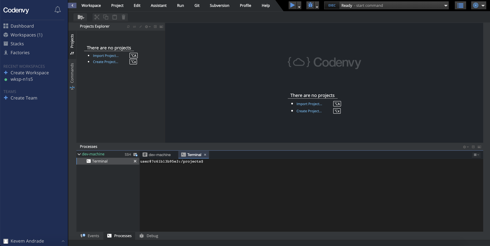

# Entramos

## Agora, precisamos criar uma área de trabalho para o nosso projeto

Na tela do dashboard, clique na opção _**Create Workspace**_ para criar uma nova área de trabalho:

Na tela que se abriu, identifique a seção _**SELECT STACK**_ , terá uma lista, procure e selecione a opção _"Python Django"_:

No final da página ou no cabeçalho, do lado superior direito, clique na opção _**CREATE**_ para confirmar a criação do ambiente.
Uma nova janela com o processamento da criação do ambiente irá surgir e ao final, aparecerá uma tela parecida com essa abaixo:

