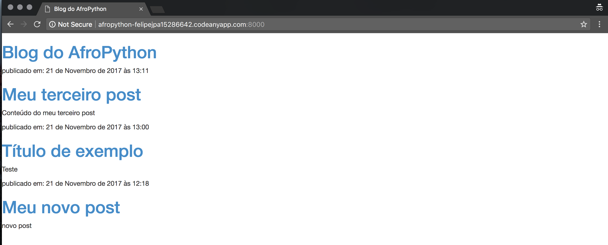

# Vamos usar o Bootstrap!

Bootstrap é um dos mais famosos e populares frameworks de HTML e CSS para desenvolver sites bonitos:

https://getbootstrap.com/

Foi escrito por programadores que trabalhavam no Twitter e agora é desenvolvido por voluntários de todo o mundo!

# Instalar Bootstrap

Para instalar o Bootstrap, você precisa adicionar isso ao seu cabeçalho <head>, dentro do seu arquivo `.html`:

blog/templates/blog/post_list.html

```<link rel="stylesheet" href="//maxcdn.bootstrapcdn.com/bootstrap/3.2.0/css/bootstrap.min.css">```

```<link rel="stylesheet" href="//maxcdn.bootstrapcdn.com/bootstrap/3.2.0/css/bootstrap-theme.min.css">```

Isso não adiciona nenhum arquivo ao seu projeto. O código apenas aponta para arquivos que existem na internet. Apenas siga em frente, abra seu site e atualize a página. Veja como está!



Já parece mais bonito!
