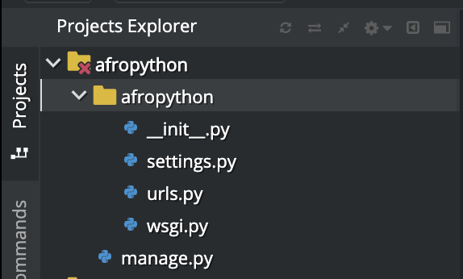

# Inciando o projeto

Pronto, agora que temos o django, podemos inciar o nosso projeto. No terminal digite o comando:

```
$ django-admin startproject afropython
```

Isso irá criar uma pasta no Project Explorer que tem a seguinte estrutura:



Bacana, agora todo o esqueleto de um projeto Django foi criado para nós: um bando de diretórios e arquivos que usaremos mais tarde.

Os nomes de alguns arquivos e diretórios são muito importantes para o Django. Não renomeie os arquivos que estamos prestes a criar. Mover para um lugar diferente também não é uma boa idéia. Django precisa manter uma determinada estrutura para ser capaz de encontrar coisas importantes.

`manage.py` é um script que ajuda com a gestão do site. Com isso seremos capazes de iniciar um servidor de web no nosso computador sem instalar nada, entre outras coisas.

O arquivo `settings.py` contém a configuração do seu site.

Lembra quando falamos sobre um carteiro verificando onde entregar uma carta? arquivo `urls.py` contém uma lista dos padrões usados por `urlresolver`.

Vamos ignorar os outros arquivos por agora - nós não vamos mudá-los. A única coisa a lembrar é não excluí-los por acidente!