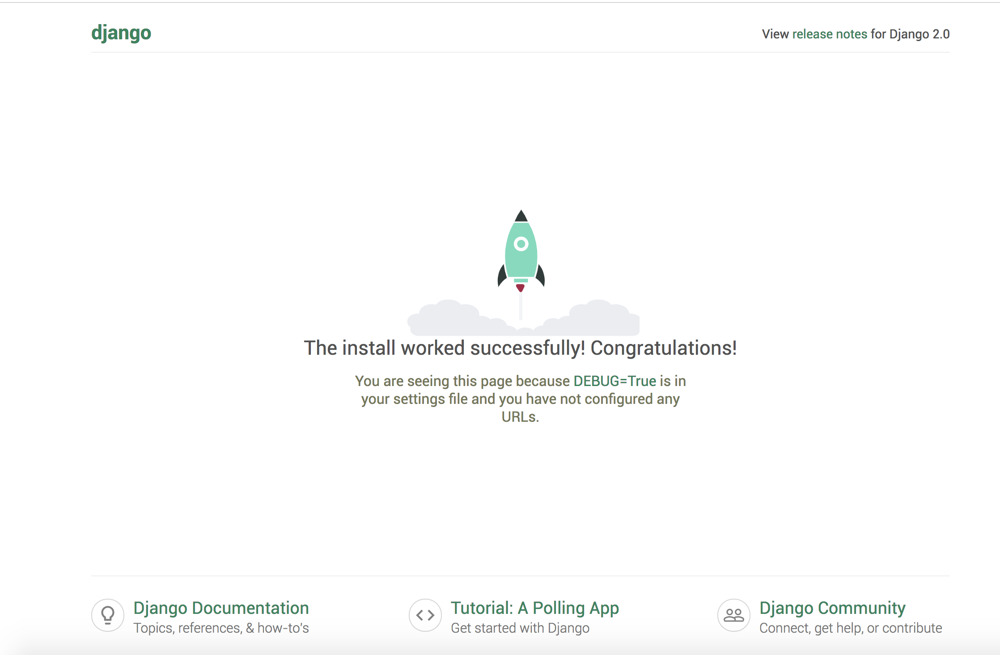

# Instalação de um banco de dados

Há vários softwares de banco de dados diferentes que pode armazenar dados para o seu site. Nós vamos usar o padrão, `sqlite3`.

Isto já está configurado nesta parte do seu arquivo `AfroPython/settings.py`:

```

DATABASES = {
    'default': {
        'ENGINE': 'django.db.backends.sqlite3',
        'NAME': os.path.join(BASE_DIR, 'db.sqlite3'),
    }
}
```

Para criar um banco de dados para o nosso blog, vamos fazer o seguinte no console. Digite:

```
python3 manage.py migrate
```

Precisamos estar no diretório que contém o arquivo `manage.py` dentro da pasta `afropython`.
Se isso der certo, você deve ver algo como isto:

```
(django) user@b3592ed04e17:/projects/afropython$ python3 manage.py migrate
Operations to perform:
  Apply all migrations: admin, auth, contenttypes, sessions
Running migrations:
  Applying contenttypes.0001_initial... OK
  Applying auth.0001_initial... OK
  Applying admin.0001_initial... OK
  Applying admin.0002_logentry_remove_auto_add... OK
  Applying admin.0003_logentry_add_action_flag_choices... OK
  Applying contenttypes.0002_remove_content_type_name... OK
  Applying auth.0002_alter_permission_name_max_length... OK
  Applying auth.0003_alter_user_email_max_length... OK
  Applying auth.0004_alter_user_username_opts... OK
  Applying auth.0005_alter_user_last_login_null... OK
  Applying auth.0006_require_contenttypes_0002... OK
  Applying auth.0007_alter_validators_add_error_messages... OK
  Applying auth.0008_alter_user_username_max_length... OK
  Applying auth.0009_alter_user_last_name_max_length... OK
  Applying auth.0010_alter_group_name_max_length... OK
  Applying auth.0011_update_proxy_permissions... OK
  Applying sessions.0001_initial... OK
```

E está pronto! Hora de iniciar o servidor web e ver se nosso site está funcionando!

// TO-DO

Parabéns! Você criou seu primeiro site e o executou usando um servidor de web! Não é impressionante?



Pronto(a) para o próximo passo? Está na hora de criar algum conteúdo!
