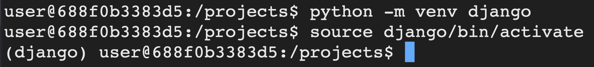

# Instalando Django

> Se você tiver na dentro da pasta ** codigo-python ** (ou, alguma outra), saia dela executando no terminal o comando `cd ..`

Precisamos executar os comandos abaixos na ordem que aparecem para instalar o django. Os dois primeiros comandos são para ativar o virtual env do python, mas você não precisa se preocupar com isso agora.

```
$ python3 -m venv django
```

> Imorpante: Precisamos usar o comando `python3` porque a versão do django que estamos usando é compatível apenas com a versão Python 3 ou maior

Esse comando irá criar uma pasta chamada ** django ** contendo alguns arquivos dentro dela, mas esse é o resultado esperado

```
$ source django/bin/activate
```

O comando acoma ativa o virtaul env no ambiente de deselvimento. Após a execução do comando acima, o teu terminal deverá aparecer o prefixo ** (django) ** a frente da linha de comando:



> Infelizmente, o Codenvy ficar inativo depois de algumperíodo de tempo ocioso e perde-se a sessão. Se isso acontecer, precisaremos atualizar o site precionando as teclas CRTL+F5 ou no botão de recarregar o navegador. Se você precisar fazer isso, você terá que ativar o virtual env novamente. É importante você exeutar esse comando sempre que tiver fazendo alguma operação no projeto.

Agora, vamos instalar o django. Execute o comando abaixo:

```
pip install Django
```

> Quando você executar esse comando, ou seja, quando você precionar a tecla ENTER, registros do que o pip está fazendo irão aparecer na tela. Se acontecer algum erro, execute de novo. Se o problema persistir, chama alguém pra te ajudar.
