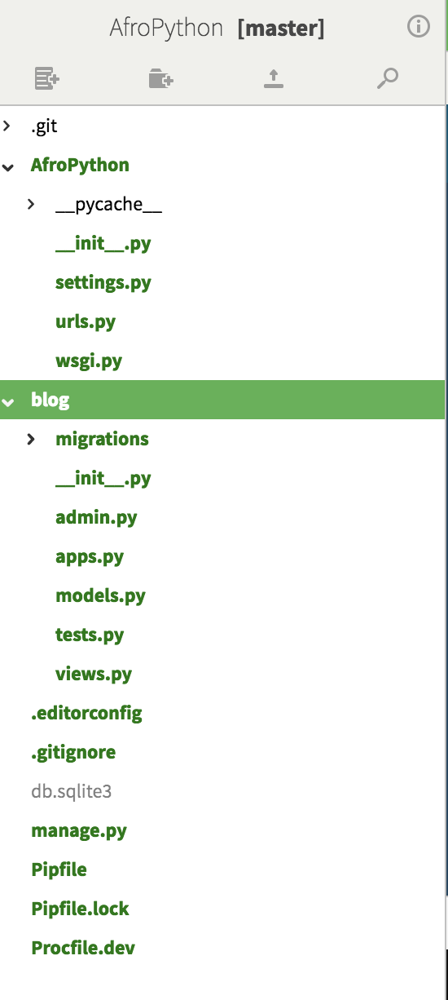

# Criando uma aplicação

Para manter tudo arrumado vamos criar um aplicativo separado dentro do nosso projeto. É muito bom ter tudo organizado desde o início. Para criar um aplicativo precisamos executar o seguinte comando no console:

…@AfroPython:/mnt/project$python3 manage.py startapp blog

Você vai notar que um novo diretório blog é criado e que ele agora contém um número de arquivos. Nossos diretórios e arquivos no nosso projeto devem se parecer com este:



Depois de criar um aplicativo também precisamos dizer ao Django que deve usá-lo. Fazemos isso no arquivo `AfroPython/settings.py`.

Precisamos encontrar o `INSTALLED_APPS` e adicionar uma linha com `'blog'`, logo acima do `]`. É assim que a configuração deve ficar:

```
INSTALLED_APPS = (
    'django.contrib.admin',
    'django.contrib.auth',
    'django.contrib.contenttypes',
    'django.contrib.sessions',
    'django.contrib.messages',
    'django.contrib.staticfiles',
    'blog',
)
```
