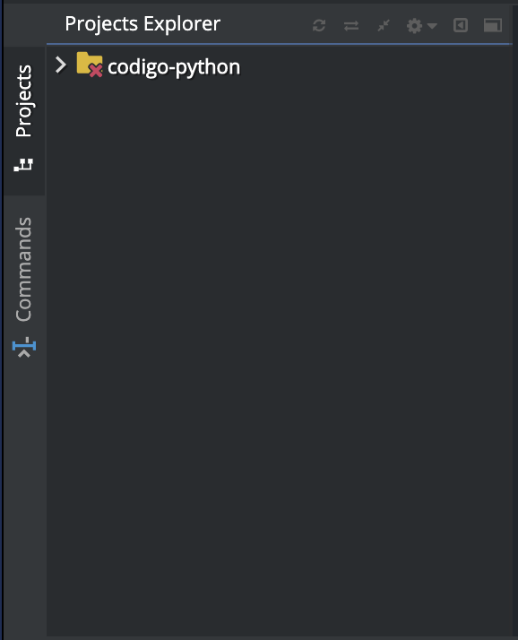
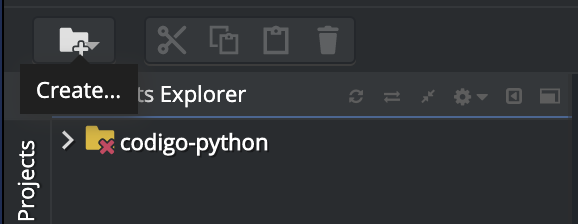
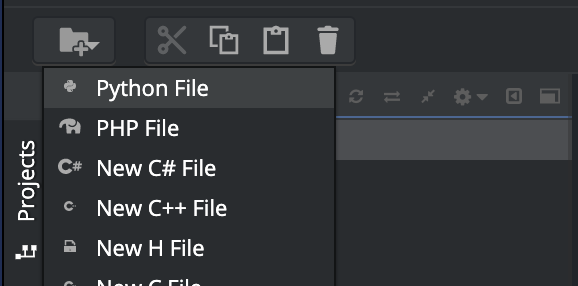
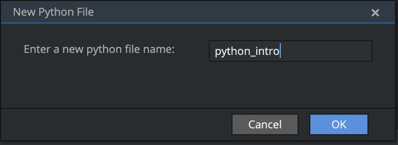
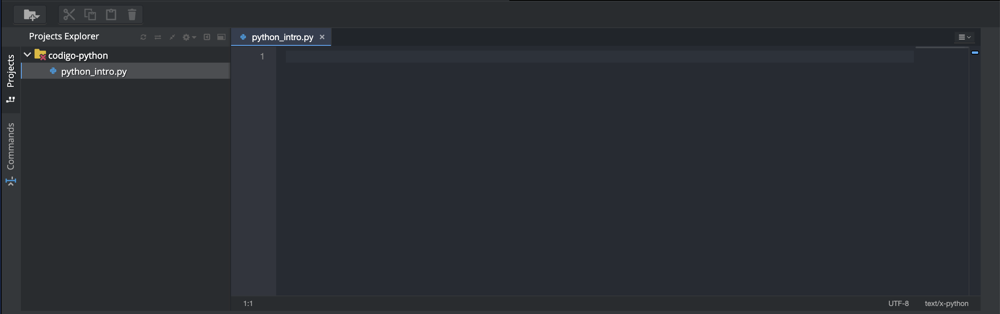

# Editor de código

Você está prestes a escrever suas primeiras linhas de código, então precisamos de um editor de código!

Existem muitos editores diferentes e em grande parte se resume a preferência pessoal. A maioria das pessoas que programam em Python usam as complexas, mas extremamente poderosas IDEs (Integrated Development Environments, ou em português, Ambiente de desenvolvimento Integrado), tais como PyCharm.

Vamos criar uma pasta chamada ** codigo-python ** que irá conter os arquivos de código que iremos criar.
Para isso, execute o comando abaixo no terminal:

```
$ mkdir codigo-python
```

Podemos ver a pasta que acabamos de criar na secção ** Projects Explorer **



Usaremos o editor interno do Codenvy. Para isso, basta criar um novo arquivo, selecionando a pasta ** codigo-python ** e clicando no primeiro botão do menu horizontal “Create...”:



Depois, seleciona o tipo de arquivo ** Python File **



Coloque o nome do arquivo como 'python_intro.py' e aperte Enter ou no botão OK:



No final, o arquivo será criado e aberto no editor. A tua tela ficará parecida com essa:


