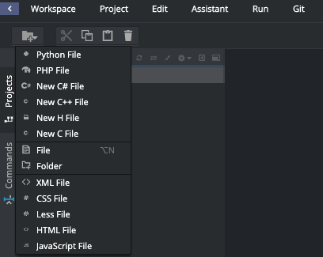

# Editor de código

Você está prestes a escrever sua primeira linha de código, então precisamos de um editor de código!

Existem muitos editores diferentes e em grande parte se resume a preferência pessoal. A maioria das pessoas que programam em Python usam as complexas, mas extremamente poderosas IDEs (Integrated Development Environments, ou em português, Ambiente de desenvolvimento Integrado), tais como PyCharm.

Para o tutorial, usaremos o editor do Sourcelair. Para isso, basta criar um novo arquivo, clicando no primeiro botão do menu horizontal “Create New File”:

Uma nova linha será criada. Coloque o nome do arquivo como 'teste' e aperte Enter:

