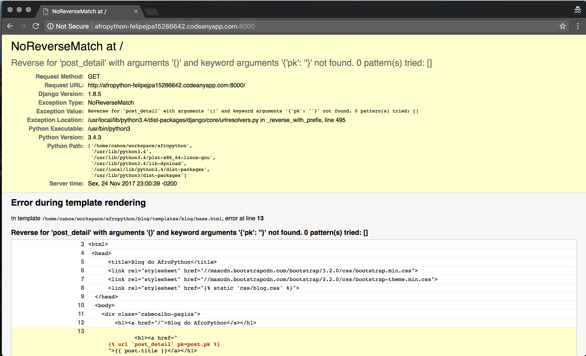
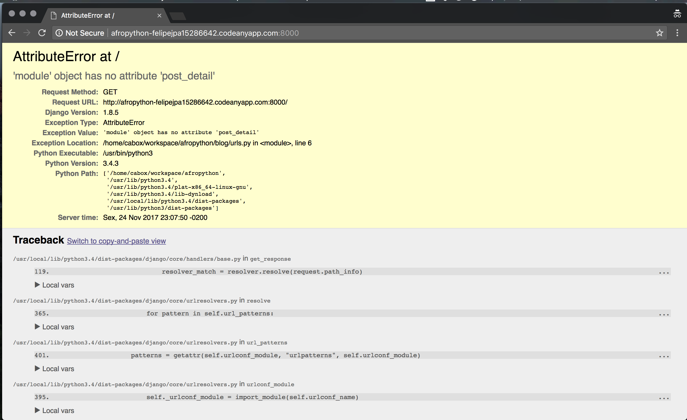
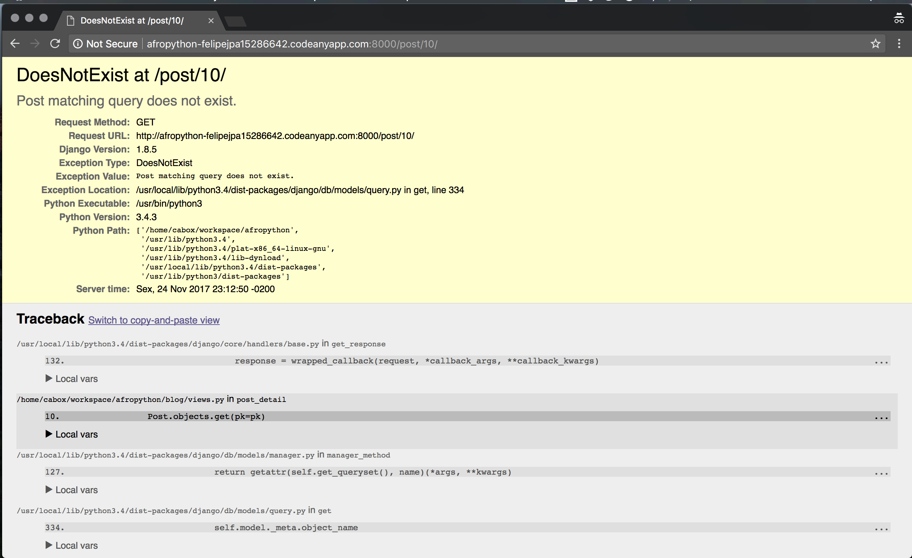
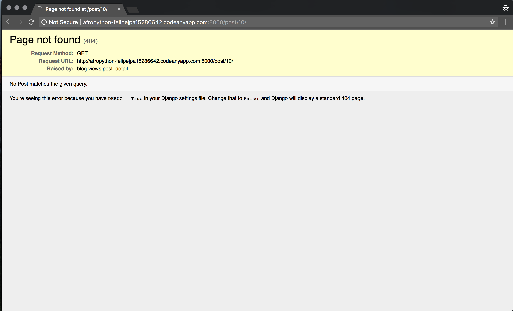
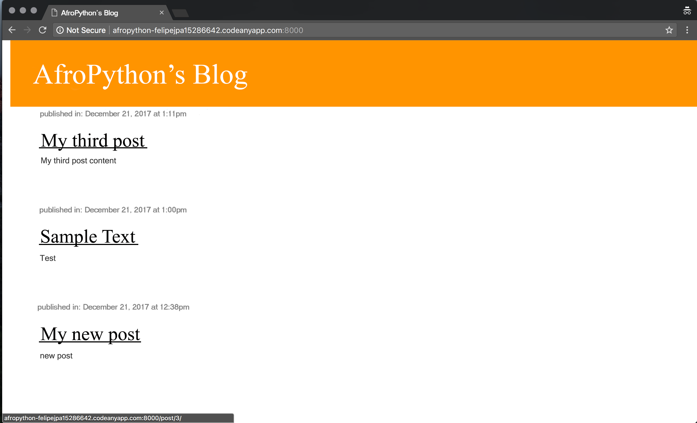
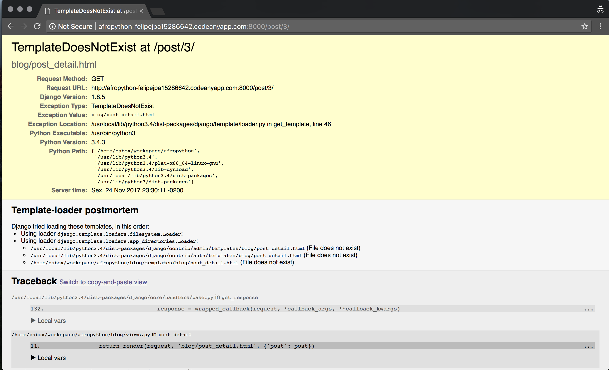
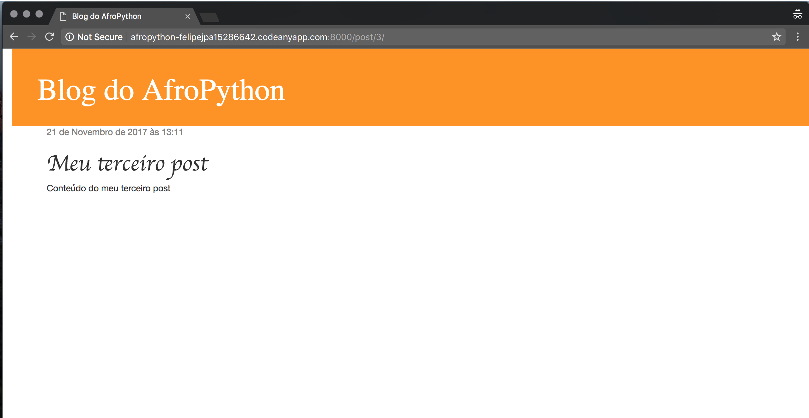

# Extend your application

We've already completed all the different steps necessary for the creation of our website: we know how to write a model, url, view and template. We also know how to make our website pretty.

Time to practice!

The first thing we need in our blog is, obviously, a page to display one post, right?

We already have a `Post` model, so we don't need to add anything to `models.py`.

## Create a template link to a post's detail

We will start with adding a link inside `blog/templates/blog/post_list.html` file. So far it should look like this:

blog/templates/blog/post_list.html
```html



    
        <div class="post">
            <div class="date">
                {{ post.published_date }}
            </div>
            <h1><a href="">{{ post.title }}</a></h1>
            <p>{{ post.text|linebreaksbr }}</p>
        </div>
    

```

We want to have a link from a post's title in the post list to the post's detail page. Let's change `<h1><a href="">{{ post.title }}</a></h1>` so that it links to the post's detail page:

blog/templates/blog/post_list.html
```html
<h1><a href="">{{ post.title }}</a></h1>
```

Time to explain the mysterious ``. As you might suspect, the  `` notation means that we are using Django template tags. This time we will use one that will create a URL for us!

The `blog.views.post_detail` is a path to the *view* `post_detail` that we want to create. Pay attention: `blog` is the name of your application (the directory `blog`), `views` is the name of the file `views.py` and, the last part - `post_detail` - is the name of the *view*.

Now when we go to: `http://<<sua_url>>.codeanyapp.com:8080/` we will have an error (as expected, since we do not yet have a URL or a *view* for `post_detail`). It will look like this:




## Create a URL to a post's detail

Vamos criar a URL em `urls.py` para a nossa *view* `post_detail`!

Nós queremos que nosso primeiro detalhe de postagem seja exibido através dessa **URL**: http://<<your_url>>.codeanyapp.com:8080/post/1/

Vamos criar uma URL no arquivo `blog/urls.py` para direcionar o Django para uma *view* de nome `post_detail`, que irá exibir uma postagem de blog completa. Adicione a linha `url(r'^post/(?P<pk>\d+)/$', views.post_detail, name='post_detail'),` ao arquivo `blog/urls.py`. O arquivo deve ficar dessa forma:

blog/urls.py
```p
from django.conf.urls import url
from . import views

urlpatterns = [
    url(r'^$', views.post_list),
    url(r'^post/(?P<pk>[0-9]+)/$', views.post_detail, name='post_detail'),
```

O trecho ``^post/(?P<pk>\d+)/$`` parece assustador, mas não se preocupe – nós iremos explicar ele para você:
 - ele começa com `^` novamente - "o início".
- `post/` apenas significa que após o início, a URL deve ter a palavra __post__ e um __/__. Até aqui, tudo bem.
- `(?P<pk>\d+)` - essa parte é mais complicada. Isso significa que o Django vai pegar tudo que você colocar aqui e transferir para uma view através de uma variável chamada `pk`. `\d` também nos diz que só pode ser um número, não uma letra (tudo entre 0 e 9). `+` significa que precisa existir um ou mais dígitos. Então, algo como `http://<<sua_url>>.codeanyapp.com:8080/post//`, não é válido, mas `http://<<sua_url>>.codeanyapp.com:8080/post/1234567890/` é perfeitamente ok!
- `/` - então precisamos de um __/__ outra vez.
- `$` - "o fim"!

Isso significa que, se você digitar `http://<<sua_url>>.codeanyapp.com:8080/post/5/` em seu navegador, Django vai entender que você está procurando uma *view* chamada `post_detail` e transferir a informação de que `pk` é igual a `5` para aquela *view*.

`pk` é uma abreviação para `primary key` (chave primária). Esse é o nome geralmente usado nos projetos feitos em Django. Mas você pode dar o nome que quiser às variáveis (lembre-se: minúsculas e `_` ao invés de espaços em branco!). Por exemplo em vez de `(?P<pk>\d+)` podemos ter uma variável `post_id`, então esta parte ficaria como: `(?P<post_id>\d+)`.

OK, nós adicionamos um novo padrão de URL ao `blog/urls.py`! Vamos atualizar a página: `http://<<sua_url>>.codeanyapp.com:8000/` Boom! O servidor parou de funcionar novamente. Dê uma olhada no console – como esperado, temos outro erro!



Você se lembra qual é o próximo passo? Claro: adicionar uma view!

## Adicionando a view de detalhe da postagem

Desta vez a nossa *view* recebe um parâmetro extra, `pk`. Nossa *view* precisa pegá-la, certo? Então vamos definir nossa função como `def post_detail (request, pk):`. Observe que precisamos usar exatamente o mesmo nome que especificamos em urls (`pk`). Omitir essa variável é errado e resultará em um erro!

Agora queremos receber apenas um post do blog. Para isso podemos usar `querysets` como este:

blog/views.py
```
def post_detail(request, pk):
    Post.objects.get(pk=pk)

```

Mas este código tem um problema. Se não houver nenhum `Post` com a `chave primária` (`pk`) fornecida teremos um erro horroroso!



Não queremos isso! Mas, claro, o Django vem com algo que vai lidar com isso para nós: `get_object_or_404`. Caso não haja nenhum `Post` com o `pk` informado, ele exibirá uma página muito mais agradável (chamada `Page Not Found 404` - página não encontrada).



A boa notícia é que você realmente pode criar sua própria página de `Page not found` e torná-la tão bonita quanto você quiser. Mas isso não é super importante agora, então nós vamos pular essa parte.

Ok, hora de adicionar uma *view* ao nosso arquivo `views.py`!

Devemos abrir `blog/views.py` e adicionar o seguinte código perto das outras linha com `from`:

blog/views.py
```
from django.shortcuts import render, get_object_or_404
```

E no final do arquivo, adicionaremos a nossa *view*:

blog/views.py
```
def post_detail(request, pk):
    post = get_object_or_404(Post, pk=pk)
    return render(request, 'blog/post_detail.html', {'post': post})
```

Sim. Está na hora de atualizar a página: http://<<sua_url>>.codeanyapp.com:8080/



Funcionou! Mas o que acontece quando você clica em um link no título do post do blog?



Ah não! Outro erro! Mas nós já sabemos como lidar com isso, não é? Precisamos adicionar um template!

## Criação de um template para o detalhe da postagem

Vamos criar um arquivo em `blog/templates/blog` chamado `post_detail.html`.

Será algo parecido com isto:

blog/templates/blog/post_detail.html
```html



    <div class="post">
        
            <div class="date">
                {{ post.published_date }}
            </div>
        
        <h1>{{ post.title }}</h1>
        <p>{{ post.text|linebreaksbr }}</p>
    </div>

```

Mais uma vez estamos estendendo `base.html`. No bloco `content` queremos exibir o `published_date` (data de publicação) da postagem (se houver), título e texto. Mas devemos discutir algumas coisas importantes, certo?

` ... ` é uma tag de template que podemos usar quando queremos verificar algo (Lembra do `if ... else...` do **capítulo introdução ao Python**?). Neste cenário, queremos verificar se `published_date` de uma postagem não está vazia.

Ok, podemos atualizar nossa página e ver se o  `TemplateDoesNotExist`já se foi.



Yay! Funciona!
