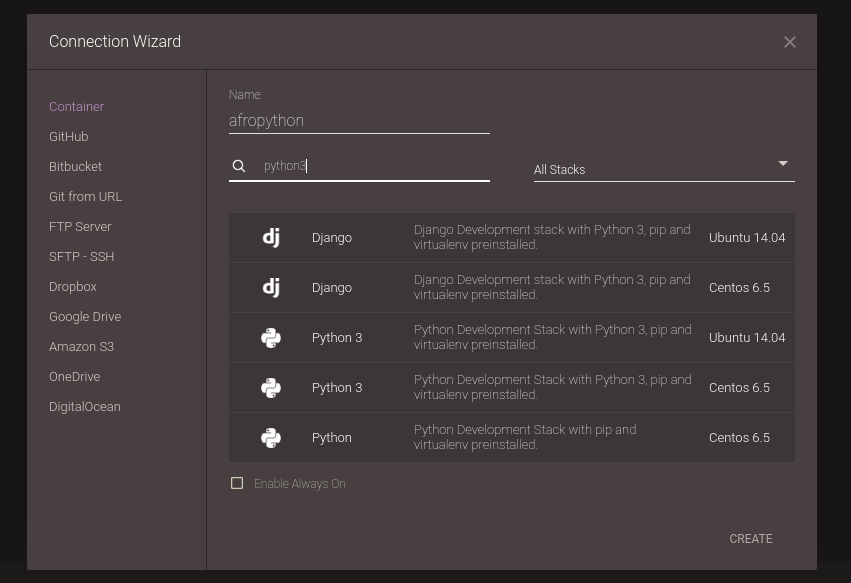

# Creating a container

## Go to the editor and create a new container

Click on the "Edit" button. It should open the Connection Wizard - if that doesn't happend, you can find it in File/New Connection/Container.

In the Connection Wizard window, name your project "afropython" and use the search stack to search for python3. There are a lot of things there, right? So, to make sure everything works out, let's choose the one that says "Python 3" **and** "Ubuntu 14.04". That means we're going to use a computer that already has GNU/Linux Ubuntu installed in it, with the most recent version of Python. After selecting it, click on "Create" (you can use the scroll bar to find that button, it's down there).

