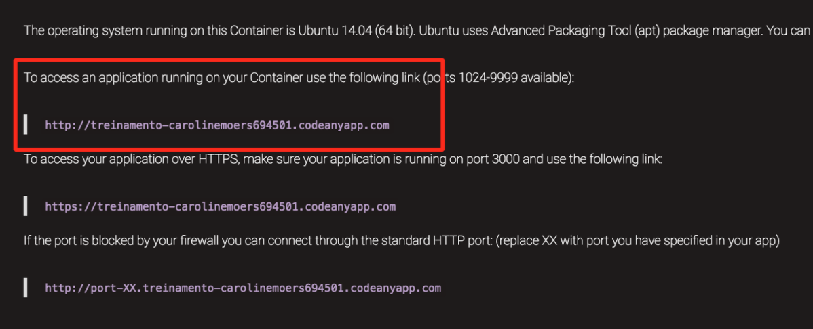

# Instalação de um banco de dados

Há vários softwares de banco de dados diferentes que pode armazenar dados para o seu site. Nós vamos usar o padrão, `sqlite3`.

Isto já está configurado nesta parte do seu arquivo `mysite/settings.py`:

```

DATABASES = {
    'default': {
        'ENGINE': 'django.db.backends.sqlite3',
        'NAME': os.path.join(BASE_DIR, 'db.sqlite3'),
    }
}
```

Para criar um banco de dados para o nosso blog, vamos fazer o seguinte no console. Digite:

```
python3 manage.py migrate
```

Precisamos estar no diretório que contém o arquivo `manage.py` dentro da pasta `afropython`.
Se isso der certo, você deve ver algo como isto:

```
~/afropython$ python3 manage.py migrate
Operations to perform:
  Apply all migrations: admin, contenttypes, auth, sessions
Running migrations:
  Applying contenttypes.0001_initial... OK
  Applying auth.0001_initial... OK
  Applying admin.0001_initial... OK
  Applying sessions.0001_initial... OK
```

E está pronto! Hora de iniciar o servidor web e ver se nosso site está funcionando!

Você precisa estar no diretório que contém o arquivo `manage.py` (no diretório afropython). No console, nós podemos iniciar o servidor web executando:
```
~/afropython$ python3 manage.py runserver 0.0.0.0:8080
```

Para acessar o site no navegador, utilize a primeira url que o codeanywhere mostra na página de informação, adicionando a porta 8080 no final da url:



Então, no exemplo, a url fica:
```
http://treinamento-carolinemoers694501.codeanyapp.com:8080
```

O servidor web vai assumir seu prompt de comando até você pará-lo: pode abrir uma nova janela do terminal, ou parar o servidor de web, alternando de volta para a janela na qual está executando e pressionando CTRL + C - botões de controle e C juntos.

Parabéns! Você criou seu primeiro site e o executou usando um servidor de web! Não é impressionante?


Pronto(a) para o próximo passo? Está na hora de criar algum conteúdo!
