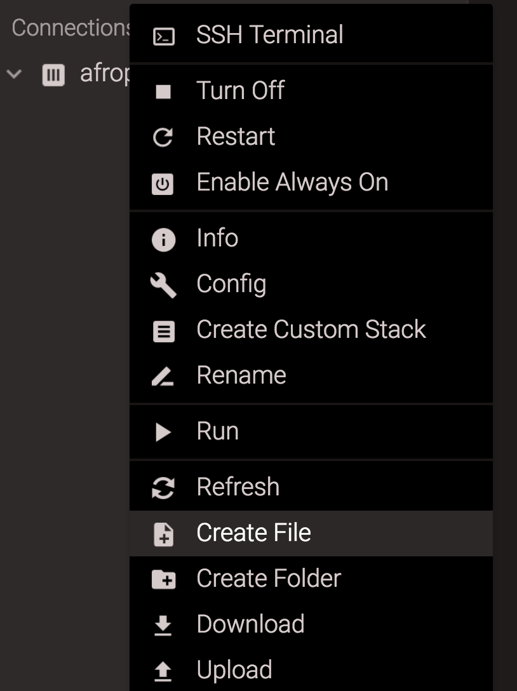
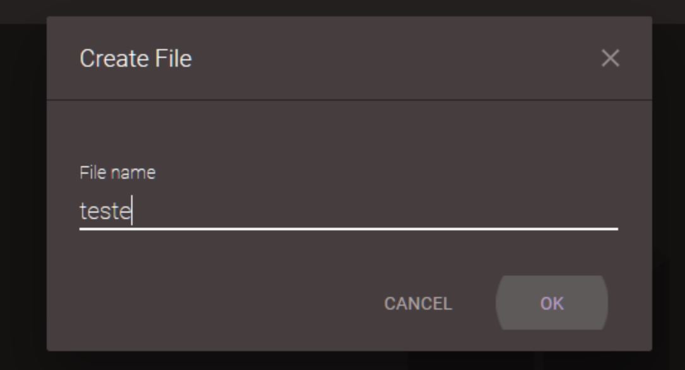

# Editor de código

Você está prestes a escrever sua primeira linha de código, então precisamos de um editor de código!

Existem muitos editores diferentes e em grande parte se resume a preferência pessoal. A maioria das pessoas que programam em Python usa as complexas, mas extremamente poderosas IDEs (Integrated Development Environments, ou em português, Ambiente de desenvolvimento Integrado), tais como PyCharm.

Para o tutorial, usaremos o editor do Codeanywhere. Para isso, basta criar um novo arquivo, clicando com o botão direito no container e escolhendo a opção “Create File”:

Vai abrir uma janela. Coloque o nome do arquivo e clique em OK:

