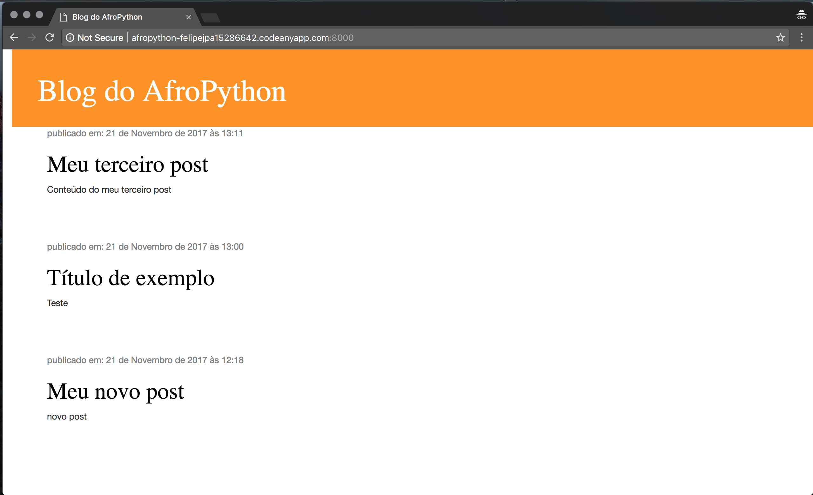

# What will your learn during this tutorial?

Once you've finished the tutorial, you will have a small functional application: your own blog! We will show you how to put it online, so others can see your work. 
It will (kinda) look like this:

Let's do this!
