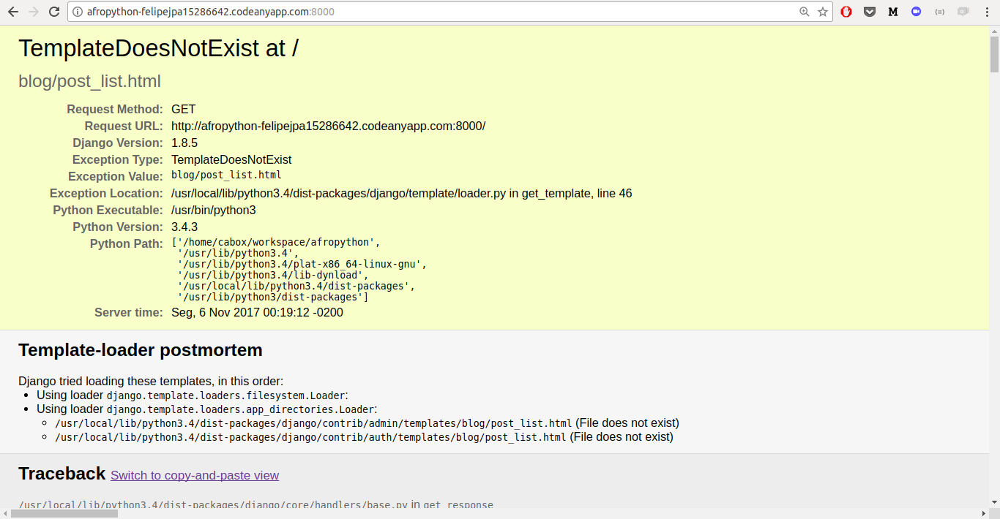

# blog/views.py

OK, vamos abrir o arquivo e ver o que tem nele:

```
from django.shortcuts import render

# Create your views here.
```

Não tem muita coisa. A view mais básica se parece com isto.

```
def post_list(request):
    return render(request, 'blog/post_list.html', {})
```

Como você pode ver, nós criamos um método (`def`) chamado `post_list` que aceita o pedido e `retorna` um método `render` será processado (para montar) nosso modelo `blog/post_list.html`.

Salve o arquivo, vá para seu endereço e veja o que temos.

Outro erro! Leia o que está acontecendo agora:



Esta é fácil: *TemplateDoesNotExist*. Vamos corrigir este bug e criar um modelo no próximo capítulo!

> Aprenda mais sobre as views do Django lendo a documentação oficial: https://docs.djangoproject.com/en/1.8/topics/http/views/