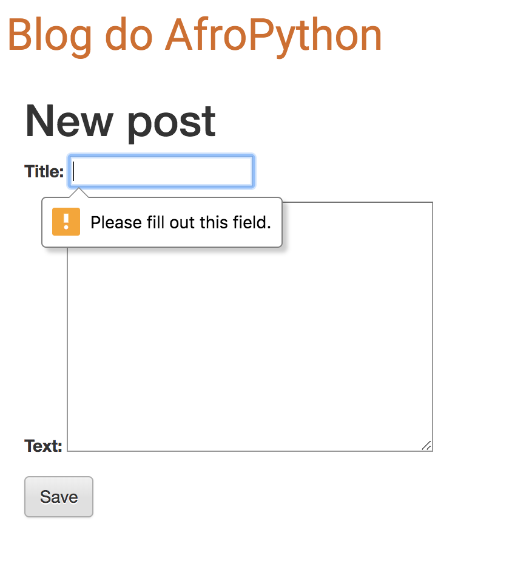

## Validação de formulários

Agora, nós lhe mostraremos como os formulários são legais. A postagem do blog precisa ter os campos `title` e `text`. Em nosso modelo `Post` não dissemos (em oposição a `published_date`) que esses campos não são necessários, então o Django, por padrão, fica na expectativa que estejam definidos.

Tente salvar o formulário sem `title` e `text`. Adivinhe o que vai acontecer!

Django está tomando conta da validação de todos os campos de nosso formulário, certificando que estão corretos. Não é incrível?