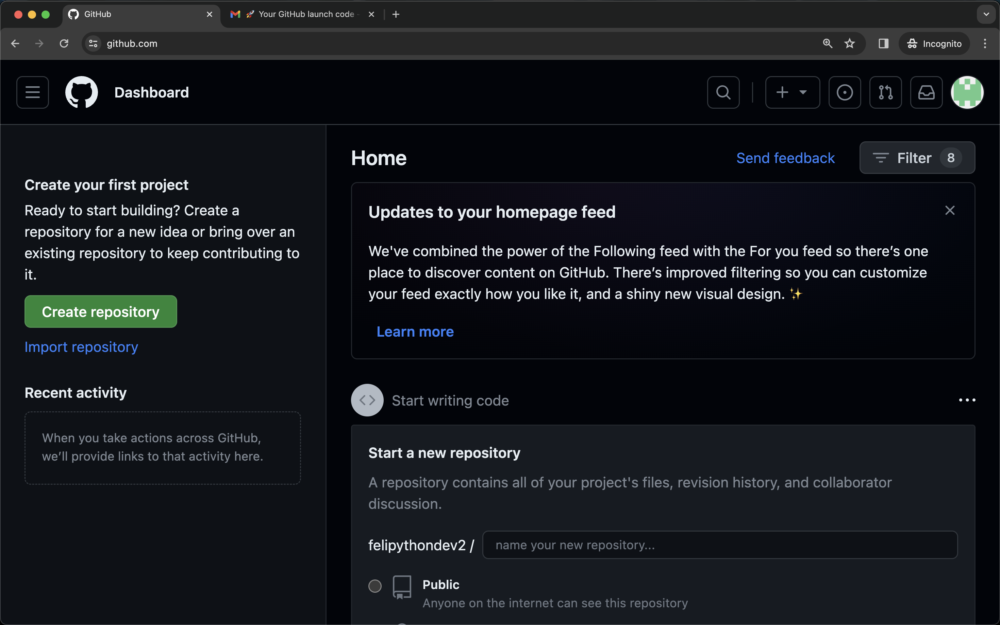

# Crie uma conta

O primeiro passo para utilizarmos o GitHub Codespaces é criar uma conta no GitHub. Acesse a página de criação de conta clicando neste link [github.com/signup](https://github.com/signup). Este link te levar para a página para criar sua conta. Você pode usar seu e-mail para criar esta conta.

# Valide seu e-mail

Após se registrar, é necessário que você valide seu e-mail. Então, certifique-se de ter acesso ao e-mail que usou para se registrar no GitHub. Você receberá um e-mail do GitHub para validar sua conta. Clique no link de validação no e-mail para confirmar sua conta.

# Complete o cadastro

Ao fim do processo de criação de uma conta você deve chegar no seu perfil do github que é algo parecido com a imagem abaixo.

