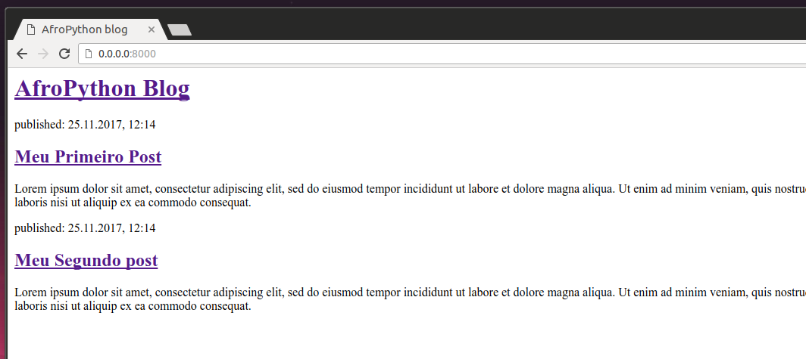

## Customize seu template

Agora você pode se divertir um pouco tentando customizar o seu template! Aqui estão algumas tags úteis para isso:

- `<h1>Um título</h1>` - para o título mais importante
- `<h2>Um sub-título</h2>` para um título um nível abaixo
- `<h3>Um sub-sub-título</h3>` ... e por aí vai, até `<h6>`
- `<em>texto</em>` enfatiza seu texto
- `<strong>text</strong>` enfatiza fortemente seu texto
- `<br />` pula para a próxima linha (você não pode colocar nada dentro de br)
- `<a href="https://djangogirls.org">link</a>` cria um link
- `<ul><li>primeiro item</li><li>segundo item</li></ul>` cria uma lista, exatamente como essa!
- `<div></div>` define uma seção da página

blog/templates/blog/post_list.html
```html
<html>
    <head>
        <title>AfroPython blog</title>
    </head>
    <body>
        <div>
            <h1><a href="">AfroPython Blog</a></h1>
        </div>

        <div>
            <p>published: 25.11.2017, 12:14</p>
            <h2><a href="">Meu Primeiro Post</a></h2>
            <p>Lorem ipsum dolor sit amet, consectetur adipiscing elit, sed do eiusmod tempor incididunt ut labore et dolore magna aliqua. Ut enim ad minim veniam, quis nostrud exercitation ullamco laboris nisi ut aliquip ex ea commodo consequat.</p>
        </div>

        <div>
            <p>published: 25.11.2017, 12:14</p>
            <h2><a href="">Meu Segundo post</a></h2>
            <p>Lorem ipsum dolor sit amet, consectetur adipiscing elit, sed do eiusmod tempor incididunt ut labore et dolore magna aliqua. Ut enim ad minim veniam, quis nostrud exercitation ullamco laboris nisi ut aliquip ex ea commodo consequat.</p>
        </div>
    </body>
</html>

```

Nós criamos três seções `div` aqui.

- O primeiro elemento `div` possui o título do nosso blog - é um título e um link
- Os outros dois elementos `div` possuem nossas postagens com a data de publicação, `h2` com o título da postagem que é clicável e dois `p`s (parágrafos) de texto, um para a data e outro para o texto da postagem.

Isso nos dá o seguinte efeito:



Yaaay! Mas, até agora, nosso template mostra exatamente __sempre a mesma informação__ - sendo que, anteriormente, nós falávamos sobre templates como uma maneira para exibir informações __diferentes__ em um __mesmo formato__.

O que nós realmente queremos fazer é exibir postagens reais que foram adicionadas no Django admin - e isso é o que faremos em seguida.
