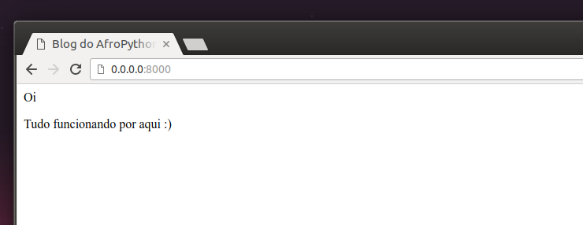

# Head & body

Cada página HTML também é dividida em dois elementos: __head__ (cabeça) e __body__ (corpo).

- __head__ é um elemento que contém informações sobre o documento que não são mostradas na tela.

- __body__ é um elemento que contém tudo o que é exibido como parte de uma página de um site.

Nós usamos a tag `<head>` para dizer ao navegador sobre as configurações da página. Por sua vez, a tag `<body>` diz ao navegador o que há de verdade na página.

Por exemplo, você pode por o elemento título de uma página web dentro da tag `<head>`. Veja:

blog/templates/blog/post_list.html
```html
<html>
    <head>
        <title>Blog do AfroPython</title>
    </head>
    <body>
        <p>Olá</p>
        <p>Está funcionando o/</p>
    </body>
</html>
```

Salve o arquivo e atualize sua página.



Viu como o navegador entendeu que "Blog do AfroPython" é o título da página? Ele interpretou `<title>Blog do AfroPython</title>` e colocou o texto na barra de título do seu navegador (e também será usado para os favoritos e outras coisas mais).

Provavelmente você já deve ter notado que cada tag de abertura casa com uma _tag de fechamento_, com uma `/`, e que os elementos estão _aninhados_ (ex.: você não pode fechar uma tag em particular antes que todas as outras tags que estiverem dentro dela já estejam fechadas).

É como colocar coisas dentro de caixas. Você tem uma grande caixa, `<html></html>`; dentro dela há `<body></body>`, sendo que esta ainda contém caixas menors: `<p></p>`.

Você precisa seguir essas regras de _fechamento_ de tags, e de _aninhamento_ de elementos - se você não fizer isso, o navegador poderá não estar apto para interpretar seu código de maneira correta e sua página será exibida de maneira incorreta.
