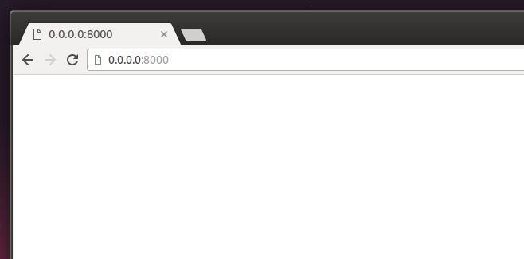

# Seu primeiro template!

Criar um template significa criar um arquivo de template. Tudo é um arquivo, certo? Provavelmente você já deve ter notado isso.

Os templates são salvos no diretório `blog/templates/blog`. Então, crie um diretório chamado `templates` dentro do diretório do seu blog. Em seguida, crie outro diretório chamado `blog` dentro da diretório templates:

    blog
    └───templates
        └───blog


(Você deve estar se perguntando porque nós precisamos de dois diretórios chamados `blog` - como você descobrirá mais para frente, essa é uma simples e útil convenção que facilita a vida quando as coisas começarem a ficar mais complicadas.)

E agora crie o arquivo `post_list.html` (deixe-o em branco por agora) dentro do diretório `blog/templates/blog`.

Veja como o nosso site está se parecendo agora: http://0.0.0.0:8000/

> Se ocorrer um erro de `TemplateDoesNotExists` tente reiniciar o seu servidor. Entre na linha de comando, pare o servidor pressionando Ctrl+C (Control seguido da tecla C, juntas) e reinicie-o rodando `python3 manage.py runserver`.



Acabaram-se os erros! Parabéns :) Entretanto, nosso site não mostra nada a não ser uma página em branco. Isso porque o nosso template está vazio. Então precisamos consertar isso.
Adicione a seguinte linha dentro do template:

blog/templates/blog/post_list.html
```html
<html>
    <p>Oi</p>
    <p>Tudo funcionando por aqui :)</p>
</html>
```

Como nosso site se parece agora? Entre no site ou clique para descobrir: http://0.0.0.0:8000/


Funcionou! Bom trabalho :)

- A tag mais básica, `<html>`, estará sempre no começo de qualquer página da web, assim como, `</html>` sempre estará no fim. Como você pode ver, todo o conteúdo de um website se encontra entre a tag de início `<html>` e entre a tag de fim `</html>`
- `<p>` é a tag que denomina parágrafos; `</p>` determina o fim de cada parágrafo
