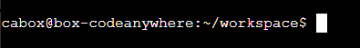

# Conhecendo a linha de comando

Para começar alguns experimentos, precisamos abrir a nossa interface de linha de comando primeiro.

#### Codeanywhere
Clique com o botão direito em cima de seu container, depois em SSH Terminal:

[imagem do ssh terminal]

#### Prompt
Agora você deve ver uma janela preta que está à espera de seus comandos.

Cada comando será antecedido pelo sinal **$** e um espaço, mas você não precisa digitá-lo. Seu computador fará isso por você :)

**Apenas uma pequena nota:** no seu caso, talvez exista algo como _cabox@box-codeanywhere:~workspace/afropython$_  antes do sinal do prompt e isto estará 100% correto. Neste tutorial nós apenas simplificaremos ele para o mínimo.
