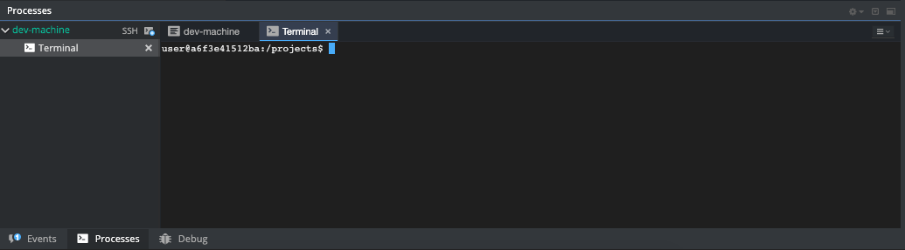
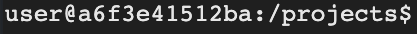

# Conhecendo a linha de comando

Para começar alguns experimentos, precisamos acessar a linha de comando primeiro.

#### Codenvy
No Codenvy, a linha de comando já está aberta para você, na parte inferior da tua tela. 

#### Prompt
Esta janela preta está à espera de seus comandos.

Cada comando será antecedido pelo sinal **$** e um espaço, mas você não precisa digitá-lo. Seu computador fará isso por você :)

