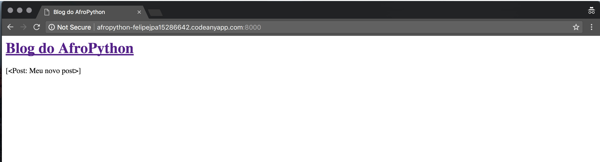
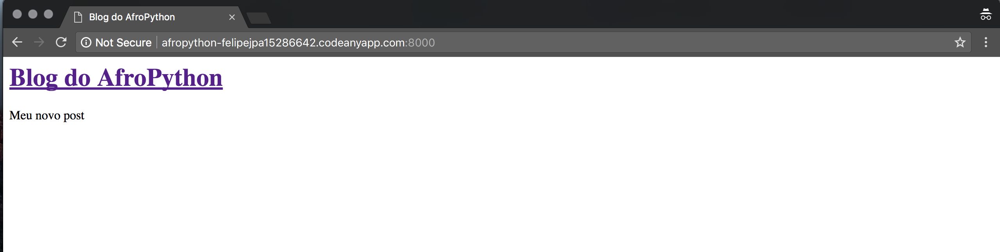
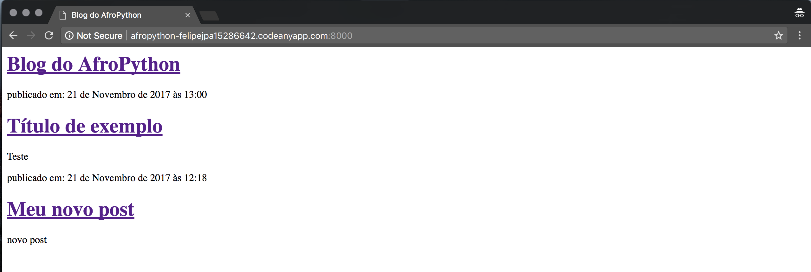

# Modelo de lista de post de exibição

No capítulo anterior, nós fornecemos ao nosso template uma lista de postagens e a variável posts. Agora vamos exibir em nosso HTML.

Para exibir uma variável no Django template, nós usamos colchetes duplos com o nome da variável dentro, exemplo:

```
{{ posts }}
```

Tente fazer isso no seu template `blog/templates/blog/post_list.html` (substituia o segundo e o terceiro par de tags `<div></div>` pela linha `{{ posts }})`, salve o arquivo e atualize a página para ver os resultados:



Você pode ver, tudo que temos é algo parecido com:

```
<QuerySet [<Post: Meu segundo post>, <Post: Meu primeiro post>]>
```

Isto significa que o Django a entende como uma lista de objetos. Lembre-se de **introdução ao Python** como podemos exibir listas? Sim, com os loops! Em um template Django, fazemos isso da seguinte maneira:

```

    {{ post }}

```

Tente fazer isso no seu template.



Funciona! Mas nós queremos que eles sejam exibidos como os posts estáticos, como os que criamos anteriormente no capítulo de **Introdução a HTML**. Nós podemos misturar HTML com tags de template. O conteúdo da `tag body` ficará assim:

```
<div>
    <h1><a href="/">Blog do AfroPython</a></h1>
</div>


    <div>
        <p>publicado em: {{ post.published_date }}</p>
        <h1><a href="">{{ post.title }}</a></h1>
        <p>{{ post.text|linebreaksbr }}</p>
    </div>

```

Tudo que você põe entre `` e `` será repetido para cada objeto na lista. Atualize sua página:



Você notou que dessa vez nós usamos uma notação um pouco diferente `{{ post.title }}` ou `{{ post.text }}`? Nós estamos acessando os dados em cada um dos campos que definimos no model do Post. Além disso, `|linebreaksbr` está passando o texto do post por um filtro, convertendo quebras de linha em parágrafos.

Parabéns! Agora vá em frente e tente adicionar um novo post em seu Django admin (Lembre-se de adicionar `published_date`!), em seguida, atualize a página para ver se o post aparece por lá.

Funciona como mágica? Estamos orgulhosos! Afaste-se do seu computador um pouco, você ganhou uma pausa. :)


