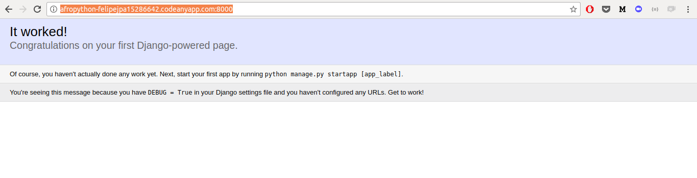

# O que é uma URL?

Uma URL é simplesmente um endereço da web, você pode ver uma URL toda vez que você visita qualquer site - é visível na barra de endereços do seu navegador (Sim! `127.0.0.1:8000` é uma URL! E [http://afropython.org](http://afropython.org) também é uma URL):

Cada página na Internet precisa de sua própria URL. Desta forma seu aplicativo sabe o que deve mostrar a um usuário que abre uma URL. Em Django, nós usamos algo chamado `URLconf` (configuração de URL), que é um conjunto de padrões que Django vai tentar coincidir com a URL recebida para encontrar a visão correta.
